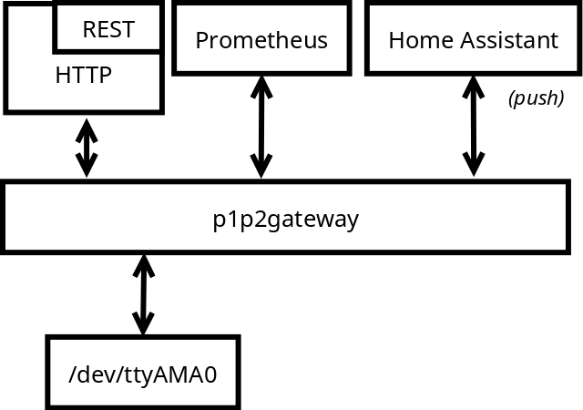

# Daikin P1/P2 bus decoder

This repository contains golang tools to
 - capture packets from a serial device
 - verify integrity of the received packets
 - decode the P1/P2 packets
 - display the data using a HTTP server
 - interface 3rdparty tools

The tools are designed to work with my custom PCB
[P1P2_HBS_USBCdc_Modem](https://github.com/siro20/P1P2_HBS_USBCdc_Modem)

Based on the awesome documentation on [P1P2Serial](https://github.com/Arnold-n/P1P2Serial)
and observations on *DAIKIN EJHA04AAV3*.

## Gateway support

The gateway tool located in `cmd/gateway` allows to interface
with the "P1P2 bus" serial device.
It exposes
- a REST HTTP server
- a prometheus client
- a HTTP POST client for Home Assistant
- a web UI in human readable form




You need to create a YAML config to properly use the gateway.
Some fields are optional.

```yaml
prometheus:
  enable: true
  port: 2112
  ListenAddress: ""
html:
  enable: true
  asset_path: /var/
  port: 80
  listen_address: ""
serial:
  enable: true
  device: /dev/ttyAMA0
  baud_rate: 115200
  parity: ""
  stop_bits: 1
homeassistant:
  enable: true
  hostname: localhost
  port: 8123
  bearer: "ABCDEFGH"
```

## Run as Home assistant gateway

If you want to interface your P1P2 bus exposed on serial device
`/dev/ttyAMA0` with Home Assistant running on the same machin,
then provide the following config.

1. Get the bearer token from Home Assisant to authenticate on the
   REST API.

2. Create a new config  `/etc/p1p2_gateway/p1p2.yaml`

```yaml
serial:
  enable: true
  device: /dev/ttyAMA0
  baud_rate: 115200
homeassistant:
  enable: true
  hostname: localhost
  bearer: "ABCDEFGH"
```

(Replace "ABCDEFGH" with your private token!)

3. Run the gateway application from `cmd/gatway`
   The gateway application will automatically create sensors and post
   sensor data if new data has been received on the serial.
   No further configuration is necessary on Home Assistant.

## Applications

Applications are located in `cmd` folder.

## Library

The decoding library is located in `pkg` folder.

## References

- [P1P2Serial](https://github.com/Arnold-n/P1P2Serial)
